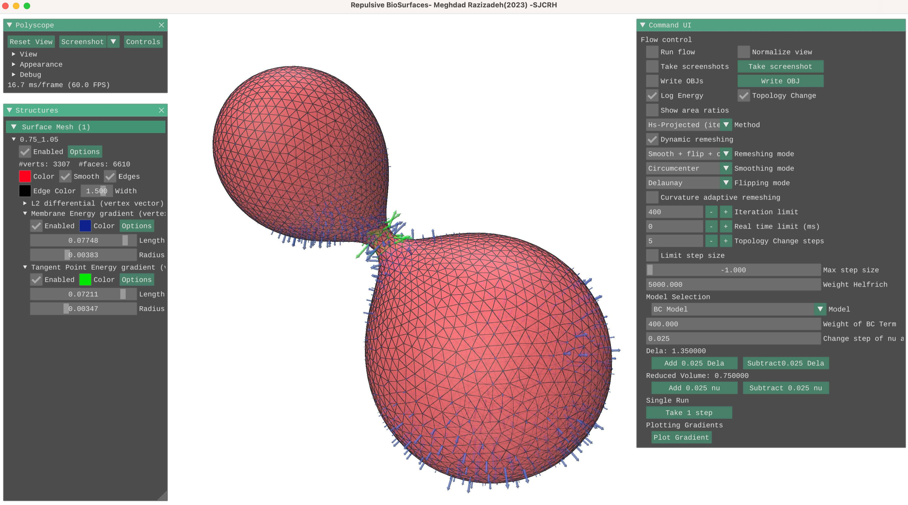

# Repulsive Biomembranes


An extension to [Repulsive Surfaces](https://dl.acm.org/doi/abs/10.1145/3478513.3480521) originally developed by [Keenan Crane Lab](https://www.cs.cmu.edu/~kmcrane/) to minimize the energy of biomembranes using bilayer-couple and area difference elasticity models.

The main motivation is to model high surface-area-to-volume cases in which the energy minimization may result in self-intersection. The idea of tangent point energy and efficient optimization of energy helped us maintain shape without self-intersection even at low reduced volumes. Discrete differential geometry implementation of the bending energy is adopted based on the [Mem3DG package](https://github.com/RangamaniLabUCSD/Mem3DG). For more information on this implementation, please refer to the [Mem3DG paper](https://www.sciencedirect.com/science/article/pii/S2667074722000192).

## Installation

### Dependencies

- **Intel oneAPI (for MKL)**  
    The project utilizes Intel Math Kernel Library (MKL). After installing oneAPI, make sure to source the environment by running:
    ```
    source /opt/intel/oneapi/setvars.sh
    ```

- **Intel Threading Building Blocks (TBB)**  
    TBB is required for parallel computing. Ensure it is installed and available on your system.

- **OpenMP**  
    The project uses OpenMP for parallel programming. You need to have OpenMP installed and properly configured.

- **Clang Compiler**  
    Clang is the preferred compiler for this project. Before running CMake, set the environment variables by executing the following commands:
    ```
    export CC=clang
    export CXX=clang++
    ```
    (These environment variables are set for the current terminal session. To make them persistent, you can add the above lines to your `~/.profile`, `~/.bashrc`, or `~/.zshrc`.)

### Build Instructions

Once the dependencies are installed and the environment is configured, you can build the project as follows:
```
cd bioRepulsiveSurfaces
mkdir build
cd build
cmake ..
make -j 4
```
### Running the Application

After successfully building the project, you can run the application using the following command:
```
./bin/biorsurfaces path/to/scene.txt 
```
Replace `path/to/scene.txt` with the path to your input scene file.

A test case is added for easier modeling of bilayer couple (BC) and area-difference elasticity (ADE) models. Navigate to repulsive_biomembranes/test_case/ and make a symbolic link to the program executable here:

```
ln -s ../build/bin/biorsurfaces
```
Then, run the program with the below command:

```
./biorsurfaces scene.txt
```
Both "sceneADE.txt" and the mesh file with the name specified in the "sceneADE.txt" should be provided.
 
In the opened GUI, select ADE or BC model from the right menu. Initially, start by making small changes to the default values or ADE model.

## Acknowledgments

This project is forked from the following repositories:

- **Repulsive Surfaces**: [link to Repulsive Surfaces repository](https://github.com/chrisyu-cs/repulsive-surfaces/blob/master/LICENSE)
- **mem3dg**: [link to mem3dg repository](https://github.com/RangamaniLabUCSD/Mem3DG/blob/main/LICENSE)

# BioRepulsiveSurfaces Docker Container

This project provides a Docker container for running the **BioRepulsiveSurfaces** application using X11 forwarding. The instructions below will guide you through the process of building and running the application using Docker on **Linux**. A brief section for **macOS** is included at the end.

## Prerequisites

Make sure you have the following installed on your system:
- **Docker**: [Install Docker](https://docs.docker.com/get-docker/) for your platform.
- **X11 (Linux)**: X11 should be installed and running on your Linux system.
- **XQuartz (macOS)**: For macOS, you'll need XQuartz installed for X11 support.

## Building the Docker Image

1. **Prepare the Dockerfile**
   Copy and paste below Dockerfile into the file named "Dockerfile"
```docker
# Use Intel oneAPI image as the base
FROM intel/oneapi-hpckit:latest

# Set environment variables for the compiler
ENV CC=clang
ENV CXX=clang++
# Allow insecure repositories
RUN wget -qO - https://repositories.intel.com/gpu/intel-graphics.key | \
  gpg --yes --dearmor --output /usr/share/keyrings/intel-graphics-archive-keyring.gpg

# Install dependencies
RUN apt-get update && apt-get install -y \
    git \
    xorg-dev \
    libglu1-mesa-dev \
    freeglut3-dev \
    mesa-common-dev \
    libomp-dev \
    cmake \
    build-essential \
    clang \
    libx11-dev \
    libnetcdf-dev \
    libxrandr-dev \
    libxinerama-dev \
    libnetcdf-c++4-dev \
    libxtst-dev \
    && rm -rf /var/lib/apt/lists/*

COPY BioRepulsiveSurfaces /app/biorsurfaces/

RUN cd /app/biorsurfaces && \
    mkdir build && \
    cd build && \
    cmake .. && \
    make -j$(nproc)

# Copy the executable into the container
RUN mkdir /app/simulation && \
    cp /app/biorsurfaces/build/bin/biorsurfaces /app/simulation && \
    cp /app/biorsurfaces/test/0.75_1.05.obj /app/simulation && \
    cp /app/biorsurfaces/test/sceneADE.txt /app/simulation

WORKDIR /app/simulation

# Set the DISPLAY environment variable for X11 forwarding
ENV DISPLAY=:0

# Set entry point to run your application
CMD ["./biorsurfaces", "sceneADE.txt"]
```


2. **Clone or prepare the project directory**:  
   Place the `Dockerfile` and the `BioRepulsiveSurfaces` codebase in the same directory. The Dockerfile is responsible for installing all dependencies and building the code inside a container.
   Please note that the Dockerfile should be in the directory of BioRepulsiveSurfaces:

Working Directory:

        |-- BioRepulsiveSurfaces  (folder)
  
        |-- Dockerfile (file)
  
4. **Build the Docker image**:  
   In the terminal, navigate to the directory containing your `Dockerfile` and run the following command:

   ```bash
   docker build -t biorsurfaces .
   ```

   This will build the Docker image and tag it as `biorsurfaces`.

   ### Explanation:
   - \`docker build -t biorsurfaces .\`: The \`-t\` flag tags the image with the name \`biorsurfaces\`. The \`.\` refers to the current directory where the Dockerfile is located.

## Running the Docker Container with X11 Forwarding (Linux)

After building the Docker image, you can run the application inside the container while forwarding the graphical interface to your host machine using X11.

1. **Allow Docker to access your X11 display**:  
   Use the \`xhost\` command to grant Docker access to your display:

   ```bash
   xhost +local:docker
   ```

2. **Run the Docker container**:  
   Run the following command to start the container and forward the GUI:

   ```bash
   docker run -e DISPLAY=$DISPLAY -v /tmp/.X11-unix:/tmp/.X11-unix --rm biorsurfaces
   ```

   ### Explanation:
   - \`-e DISPLAY=$DISPLAY\`: Passes the current display environment variable to the container.
   - \`-v /tmp/.X11-unix:/tmp/.X11-unix\`: Mounts the X11 socket from your host machine to the container so the GUI can be displayed on your local machine.
   - \`--rm\`: Automatically removes the container once it exits.
   - \`biorsurfaces\`: The name of the Docker image to run.

3. **View the GUI**:  
   The BioRepulsiveSurfaces application will now run inside the Docker container, and the graphical interface will be displayed on your Linux desktop.

### Permissions Issue:

If you encounter any issues related to permission when running the container (e.g., X11 socket access issues), you may need to adjust the permissions of the X11 socket:

```bash
sudo chmod 1777 /tmp/.X11-unix
```

## macOS (with XQuartz)

If you're running the Docker container on macOS, you will need to use **XQuartz** to enable X11 forwarding.

1. **Install XQuartz**:  
   Download and install [XQuartz](https://www.xquartz.org/).

2. **Allow connections from network clients**:  
   Open **XQuartz**, go to **Preferences > Security**, and check **"Allow connections from network clients"**.

3. **Allow Docker to connect to XQuartz**:  
   Run the following command in your terminal:

   ```bash
   xhost + 127.0.0.1
   ```

4. **Find your \`DISPLAY\` variable**:  
   Run \`echo $DISPLAY\` in your terminal to find your display address, which typically looks like \`/private/tmp/com.apple.launchd.<random_string>/org.xquartz:0\`.

5. **Run the Docker container**:

   ```bash
   docker run -e DISPLAY=/private/tmp/com.apple.launchd.<random_string>/org.xquartz:0 \
              -v /private/tmp/.X11-unix:/tmp/.X11-unix --rm biorsurfaces
   ```

---

That's it! This guide should allow you to build and run the BioRepulsiveSurfaces application inside a Docker container on Linux and macOS.
